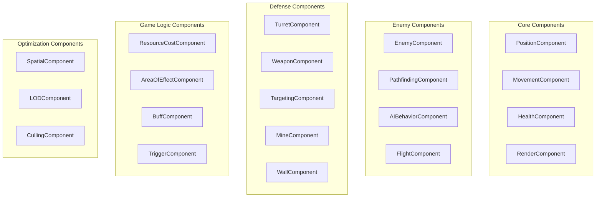
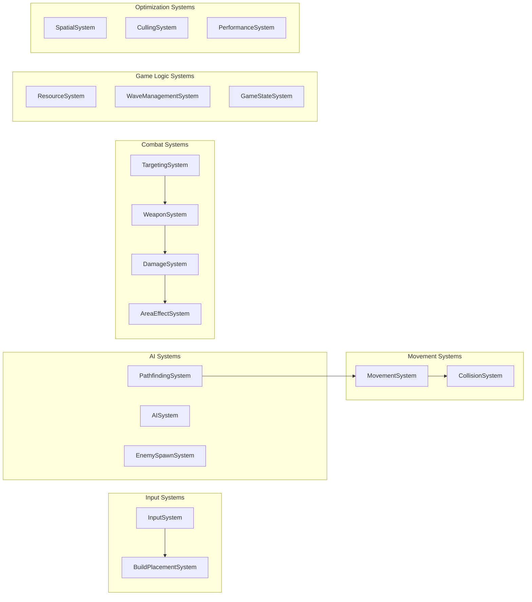
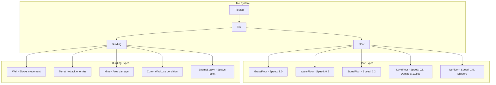
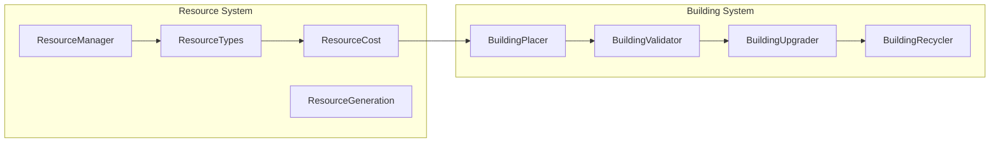
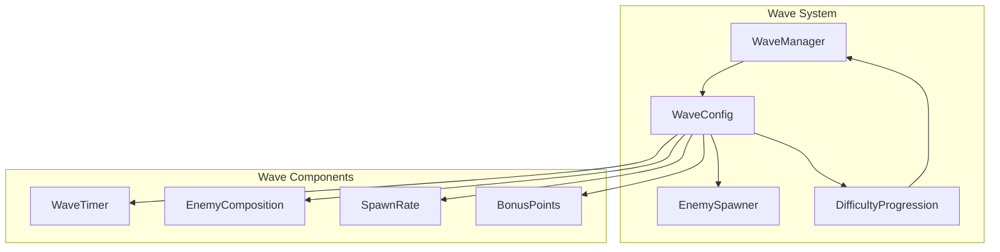

# Детализированный план ECS архитектуры для Tower Defense игры

## 1. Анализ текущего состояния

Текущая архитектура уже имеет базовую ECS структуру:
- `ECSManager` - управление сущностями и компонентами
- Базовые компоненты: `PositionComponent`, `MovementComponent`, `DamageComponent`
- Системы: `DamageSystem`, `EnemyMovementSystem`, `EnemySpawnSystem`
- Тайловая система с `Floor` и `Building`

## 2. Требования к производительности

- **Масштабируемость**: до 500 врагов, 200 турелей, карта 100x100 тайлов
- **Типы врагов**: пехота, быстрые разведчики, тяжелые танки, летающие дроны
- **Типы защиты**: стены, пушечные турели, лазерные турели, мины

## 3. Расширенная архитектура компонентов



## 4. Системная архитектура



## 5. Детализированные компоненты

### 5.1 Базовые компоненты

#### PositionComponent
```csharp
public class PositionComponent : Component
{
    public Vector2 WorldPosition { get; set; }
    public Point TilePosition { get; set; }
    public float Rotation { get; set; }
    public Vector2 PreviousPosition { get; set; }
}
```

#### HealthComponent
```csharp
public class HealthComponent : Component
{
    public int MaxHealth { get; set; }
    public int CurrentHealth { get; set; }
    public float RegenerationRate { get; set; }
    public bool IsInvulnerable { get; set; }
    public Dictionary<DamageType, float> Resistances { get; set; }
}
```

#### MovementComponent
```csharp
public class MovementComponent : Component
{
    public float BaseSpeed { get; set; }
    public float CurrentSpeed { get; set; }
    public Vector2 Velocity { get; set; }
    public Vector2 Acceleration { get; set; }
    public List<SpeedModifier> SpeedModifiers { get; set; }
}
```

#### RenderComponent
```csharp
public class RenderComponent : Component
{
    public Texture2D Texture { get; set; }
    public Rectangle SourceRect { get; set; }
    public Color Tint { get; set; }
    public float Scale { get; set; }
    public int Layer { get; set; }
    public bool IsVisible { get; set; }
    public Animation CurrentAnimation { get; set; }
}
```

### 5.2 Компоненты врагов

#### EnemyComponent
```csharp
public class EnemyComponent : Component
{
    public EnemyType Type { get; set; }
    public int RewardValue { get; set; }
    public int Priority { get; set; }
    public EnemyState State { get; set; }
    public float SpawnTime { get; set; }
}
```

#### PathfindingComponent
```csharp
public class PathfindingComponent : Component
{
    public Queue<Vector2> Path { get; set; }
    public Vector2 Target { get; set; }
    public PathfindingAlgorithm Algorithm { get; set; }
    public float RecalculationTimer { get; set; }
    public bool NeedsRecalculation { get; set; }
    public MovementType MovementType { get; set; } // Ground, Air
}
```

#### AIBehaviorComponent
```csharp
public class AIBehaviorComponent : Component
{
    public AIState CurrentState { get; set; }
    public Dictionary<AIState, IBehavior> Behaviors { get; set; }
    public float StateTimer { get; set; }
    public Entity Target { get; set; }
    public float AggroRange { get; set; }
}
```

#### FlightComponent
```csharp
public class FlightComponent : Component
{
    public float FlightHeight { get; set; }
    public bool CanFlyOverObstacles { get; set; }
    public float LandingSpeed { get; set; }
    public bool IsLanding { get; set; }
}
```

### 5.3 Компоненты защиты

#### TurretComponent
```csharp
public class TurretComponent : Component
{
    public float AttackRange { get; set; }
    public float RotationSpeed { get; set; }
    public float CurrentRotation { get; set; }
    public TurretType Type { get; set; }
    public bool CanRotate360 { get; set; }
    public float MinRotation { get; set; }
    public float MaxRotation { get; set; }
}
```

#### WeaponComponent
```csharp
public class WeaponComponent : Component
{
    public int Damage { get; set; }
    public float FireRate { get; set; }
    public float LastFireTime { get; set; }
    public AmmoType AmmoType { get; set; }
    public int AmmoCount { get; set; }
    public int MaxAmmo { get; set; }
    public float ReloadTime { get; set; }
    public bool IsReloading { get; set; }
    public DamageType DamageType { get; set; }
}
```

#### TargetingComponent
```csharp
public class TargetingComponent : Component
{
    public Entity CurrentTarget { get; set; }
    public List<Entity> PotentialTargets { get; set; }
    public TargetPriority Priority { get; set; }
    public float TargetingRange { get; set; }
    public bool RequiresLineOfSight { get; set; }
    public float PredictionAccuracy { get; set; }
}
```

#### MineComponent
```csharp
public class MineComponent : Component
{
    public float ExplosionRadius { get; set; }
    public int ExplosionDamage { get; set; }
    public TriggerType TriggerType { get; set; }
    public float TriggerDelay { get; set; }
    public bool IsArmed { get; set; }
    public List<Entity> TriggeredBy { get; set; }
    public bool IsReusable { get; set; }
}
```

#### WallComponent
```csharp
public class WallComponent : Component
{
    public WallType Type { get; set; }
    public bool BlocksMovement { get; set; }
    public bool BlocksProjectiles { get; set; }
    public Dictionary<DamageType, float> DamageReduction { get; set; }
    public List<SpecialEffect> OnDamageEffects { get; set; }
}
```

### 5.4 Игровые компоненты

#### ResourceCostComponent
```csharp
public class ResourceCostComponent : Component
{
    public Dictionary<ResourceType, int> BuildCost { get; set; }
    public Dictionary<ResourceType, int> UpgradeCost { get; set; }
    public Dictionary<ResourceType, int> MaintenanceCost { get; set; }
    public float MaintenanceInterval { get; set; }
}
```

#### AreaOfEffectComponent
```csharp
public class AreaOfEffectComponent : Component
{
    public float Radius { get; set; }
    public EffectType EffectType { get; set; }
    public float Duration { get; set; }
    public float Intensity { get; set; }
    public bool AffectsAllies { get; set; }
    public bool AffectsEnemies { get; set; }
}
```

#### BuffComponent
```csharp
public class BuffComponent : Component
{
    public List<Buff> ActiveBuffs { get; set; }
    public Dictionary<BuffType, float> Immunities { get; set; }
}

public class Buff
{
    public BuffType Type { get; set; }
    public float Duration { get; set; }
    public float Intensity { get; set; }
    public Entity Source { get; set; }
    public bool IsStackable { get; set; }
}
```

#### TriggerComponent
```csharp
public class TriggerComponent : Component
{
    public List<TriggerCondition> Conditions { get; set; }
    public List<TriggerAction> Actions { get; set; }
    public bool IsRepeatable { get; set; }
    public float Cooldown { get; set; }
    public float LastTriggerTime { get; set; }
}
```

### 5.5 Компоненты оптимизации

#### SpatialComponent
```csharp
public class SpatialComponent : Component
{
    public Rectangle BoundingBox { get; set; }
    public QuadTreeNode QuadTreeNode { get; set; }
    public List<Entity> NearbyEntities { get; set; }
    public float LastSpatialUpdate { get; set; }
}
```

#### LODComponent
```csharp
public class LODComponent : Component
{
    public LODLevel CurrentLOD { get; set; }
    public float DistanceFromCamera { get; set; }
    public Dictionary<LODLevel, LODSettings> LODSettings { get; set; }
}
```

#### CullingComponent
```csharp
public class CullingComponent : Component
{
    public bool IsVisible { get; set; }
    public bool WasVisibleLastFrame { get; set; }
    public CullingType CullingType { get; set; }
    public float CullingDistance { get; set; }
}
```

## 6. Системы и их функциональность

### 6.1 PathfindingSystem
```csharp
public class PathfindingSystem : System
{
    private readonly AStar _astar;
    private readonly Dijkstra _dijkstra;
    private readonly Dictionary<Entity, Queue<Vector2>> _pathCache;
    private readonly Dictionary<string, Queue<Vector2>> _commonPaths;
    
    public override void Update(GameTime gameTime)
    {
        // Обновление путей для всех сущностей с PathfindingComponent
        // Динамическое перестроение при изменении препятствий
        // Кэширование часто используемых путей
        // Асинхронный расчет сложных путей
    }
    
    private Queue<Vector2> CalculatePath(Vector2 start, Vector2 end, MovementType movementType)
    {
        // Выбор алгоритма в зависимости от типа движения
        // A* для наземных юнитов
        // Упрощенный алгоритм для летающих
    }
    
    private void RecalculatePathsOnObstacleChange(Point tilePosition)
    {
        // Перерасчет путей при изменении препятствий
        // Оптимизация через проверку затронутых областей
    }
}
```

### 6.2 TargetingSystem
```csharp
public class TargetingSystem : System
{
    private readonly SpatialHashGrid _spatialGrid;
    
    public override void Update(GameTime gameTime)
    {
        var turrets = _world.ECSManager.GetEntitiesWithComponents<TurretComponent, TargetingComponent>();
        
        foreach (var turret in turrets)
        {
            UpdateTargeting(turret, gameTime);
        }
    }
    
    private void UpdateTargeting(Entity turret, GameTime gameTime)
    {
        var targeting = _world.ECSManager.GetComponent<TargetingComponent>(turret);
        var turretComp = _world.ECSManager.GetComponent<TurretComponent>(turret);
        var position = _world.ECSManager.GetComponent<PositionComponent>(turret);
        
        // Поиск целей в радиусе действия
        var potentialTargets = FindTargetsInRange(position.WorldPosition, turretComp.AttackRange);
        
        // Приоритизация целей
        var bestTarget = SelectBestTarget(potentialTargets, targeting.Priority);
        
        // Предсказание траектории движения
        if (bestTarget != null)
        {
            var predictedPosition = PredictTargetPosition(bestTarget, gameTime);
            targeting.CurrentTarget = bestTarget;
        }
    }
    
    private List<Entity> FindTargetsInRange(Vector2 position, float range)
    {
        // Использование пространственного индексирования для быстрого поиска
        return _spatialGrid.GetEntitiesInRadius(position, range)
            .Where(e => _world.ECSManager.GetComponent<EnemyComponent>(e) != null)
            .ToList();
    }
}
```

### 6.3 WeaponSystem
```csharp
public class WeaponSystem : System
{
    public override void Update(GameTime gameTime)
    {
        var weaponEntities = _world.ECSManager.GetEntitiesWithComponents<WeaponComponent, TargetingComponent>();
        
        foreach (var entity in weaponEntities)
        {
            ProcessWeapon(entity, gameTime);
        }
    }
    
    private void ProcessWeapon(Entity entity, GameTime gameTime)
    {
        var weapon = _world.ECSManager.GetComponent<WeaponComponent>(entity);
        var targeting = _world.ECSManager.GetComponent<TargetingComponent>(entity);
        
        // Проверка перезарядки
        if (weapon.IsReloading)
        {
            UpdateReload(weapon, gameTime);
            return;
        }
        
        // Проверка возможности стрельбы
        if (CanFire(weapon, gameTime) && targeting.CurrentTarget != null)
        {
            Fire(entity, targeting.CurrentTarget, gameTime);
        }
    }
    
    private void Fire(Entity shooter, Entity target, GameTime gameTime)
    {
        var weapon = _world.ECSManager.GetComponent<WeaponComponent>(shooter);
        var shooterPos = _world.ECSManager.GetComponent<PositionComponent>(shooter);
        var targetPos = _world.ECSManager.GetComponent<PositionComponent>(target);
        
        // Создание снаряда или мгновенное нанесение урона
        switch (weapon.AmmoType)
        {
            case AmmoType.Projectile:
                CreateProjectile(shooterPos.WorldPosition, targetPos.WorldPosition, weapon);
                break;
            case AmmoType.Laser:
                ApplyInstantDamage(target, weapon);
                break;
            case AmmoType.AreaOfEffect:
                CreateExplosion(targetPos.WorldPosition, weapon);
                break;
        }
        
        weapon.LastFireTime = (float)gameTime.TotalGameTime.TotalSeconds;
        weapon.AmmoCount--;
        
        if (weapon.AmmoCount <= 0)
        {
            StartReload(weapon);
        }
    }
}
```

### 6.4 SpatialSystem
```csharp
public class SpatialSystem : System
{
    private readonly QuadTree _quadTree;
    private readonly SpatialHashGrid _hashGrid;
    
    public override void Update(GameTime gameTime)
    {
        // Обновление пространственных структур данных
        UpdateQuadTree();
        UpdateHashGrid();
        
        // Обновление компонентов SpatialComponent
        UpdateSpatialComponents();
    }
    
    private void UpdateQuadTree()
    {
        _quadTree.Clear();
        
        var spatialEntities = _world.ECSManager.GetEntitiesWithComponents<PositionComponent, SpatialComponent>();
        
        foreach (var entity in spatialEntities)
        {
            var position = _world.ECSManager.GetComponent<PositionComponent>(entity);
            var spatial = _world.ECSManager.GetComponent<SpatialComponent>(entity);
            
            spatial.BoundingBox = CalculateBoundingBox(entity);
            _quadTree.Insert(entity, spatial.BoundingBox);
        }
    }
    
    public List<Entity> GetNearbyEntities(Vector2 position, float radius)
    {
        var searchArea = new Rectangle(
            (int)(position.X - radius),
            (int)(position.Y - radius),
            (int)(radius * 2),
            (int)(radius * 2)
        );
        
        return _quadTree.Query(searchArea);
    }
}
```

### 6.5 MovementSystem
```csharp
public class MovementSystem : System
{
    public override void Update(GameTime gameTime)
    {
        var movingEntities = _world.ECSManager.GetEntitiesWithComponents<PositionComponent, MovementComponent>();
        
        foreach (var entity in movingEntities)
        {
            UpdateMovement(entity, gameTime);
        }
    }
    
    private void UpdateMovement(Entity entity, GameTime gameTime)
    {
        var position = _world.ECSManager.GetComponent<PositionComponent>(entity);
        var movement = _world.ECSManager.GetComponent<MovementComponent>(entity);
        var pathfinding = _world.ECSManager.GetComponent<PathfindingComponent>(entity);
        
        // Сохранение предыдущей позиции
        position.PreviousPosition = position.WorldPosition;
        
        // Обновление скорости с учетом модификаторов
        UpdateSpeed(movement);
        
        // Движение по пути
        if (pathfinding?.Path != null && pathfinding.Path.Count > 0)
        {
            MoveAlongPath(position, movement, pathfinding, gameTime);
        }
        
        // Применение модификаторов поверхности
        ApplyTerrainModifiers(entity, position);
        
        // Обновление тайловой позиции
        UpdateTilePosition(position);
    }
    
    private void MoveAlongPath(PositionComponent position, MovementComponent movement, 
                              PathfindingComponent pathfinding, GameTime gameTime)
    {
        var target = pathfinding.Path.Peek();
        var direction = Vector2.Normalize(target - position.WorldPosition);
        var distance = Vector2.Distance(position.WorldPosition, target);
        
        var moveDistance = movement.CurrentSpeed * (float)gameTime.ElapsedGameTime.TotalSeconds;
        
        if (distance <= moveDistance)
        {
            // Достигли точки пути
            position.WorldPosition = target;
            pathfinding.Path.Dequeue();
        }
        else
        {
            // Движение к точке
            position.WorldPosition += direction * moveDistance;
        }
    }
}
```

### 6.6 CollisionSystem
```csharp
public class CollisionSystem : System
{
    public override void Update(GameTime gameTime)
    {
        // Проверка коллизий между различными типами объектов
        CheckEnemyWallCollisions();
        CheckProjectileCollisions();
        CheckMineActivations();
        CheckAreaEffectCollisions();
    }
    
    private void CheckEnemyWallCollisions()
    {
        var enemies = _world.ECSManager.GetEntitiesWithComponents<EnemyComponent, PositionComponent>();
        
        foreach (var enemy in enemies)
        {
            var position = _world.ECSManager.GetComponent<PositionComponent>(enemy);
            var tile = _world.TileMap.GetTileAt(position.TilePosition);
            
            if (tile?.Building != null && tile.Building.IsSolid)
            {
                // Обработка коллизии с препятствием
                HandleWallCollision(enemy, tile.Building);
            }
        }
    }
    
    private void CheckMineActivations()
    {
        var mines = _world.ECSManager.GetEntitiesWithComponents<MineComponent, PositionComponent>();
        var enemies = _world.ECSManager.GetEntitiesWithComponents<EnemyComponent, PositionComponent>();
        
        foreach (var mine in mines)
        {
            var mineComp = _world.ECSManager.GetComponent<MineComponent>(mine);
            var minePos = _world.ECSManager.GetComponent<PositionComponent>(mine);
            
            if (!mineComp.IsArmed) continue;
            
            foreach (var enemy in enemies)
            {
                var enemyPos = _world.ECSManager.GetComponent<PositionComponent>(enemy);
                var distance = Vector2.Distance(minePos.WorldPosition, enemyPos.WorldPosition);
                
                if (distance <= mineComp.ExplosionRadius)
                {
                    ActivateMine(mine, enemy);
                    break;
                }
            }
        }
    }
}
```

## 7. Архитектура тайловой системы



### 7.1 Расширенная система поверхностей

```csharp
public enum FloorType
{
    Grass,      // Базовая скорость
    Water,      // Замедление наземных юнитов
    Stone,      // Ускорение движения
    Lava,       // Урон по времени
    Ice,        // Скольжение, потеря контроля
    Mud,        // Сильное замедление
    Sand,       // Легкое замедление
    Metal       // Проводит электричество
}

public class FloorEffects
{
    public float SpeedModifier { get; set; } = 1.0f;
    public float DamagePerSecond { get; set; } = 0.0f;
    public bool CausesSlipping { get; set; } = false;
    public bool ConductsElectricity { get; set; } = false;
    public List<BuffType> AppliedBuffs { get; set; } = new();
}
```

## 8. Система экономики и ресурсов



### 8.1 Система ресурсов

```csharp
public enum ResourceType
{
    Energy,     // Основная валюта
    Metal,      // Для продвинутых построек
    Crystal,    // Для специальных технологий
    Research    // Для улучшений
}

public class ResourceManager
{
    private Dictionary<ResourceType, int> _resources;
    private Dictionary<ResourceType, float> _income;
    private List<ResourceGenerator> _generators;
    
    public bool CanAfford(Dictionary<ResourceType, int> cost)
    {
        return cost.All(kvp => _resources.GetValueOrDefault(kvp.Key, 0) >= kvp.Value);
    }
    
    public bool SpendResources(Dictionary<ResourceType, int> cost)
    {
        if (!CanAfford(cost)) return false;
        
        foreach (var kvp in cost)
        {
            _resources[kvp.Key] -= kvp.Value;
        }
        
        return true;
    }
    
    public void Update(GameTime gameTime)
    {
        // Обновление генерации ресурсов
        foreach (var generator in _generators)
        {
            generator.Update(gameTime);
        }
    }
}
```

### 8.2 Система строительства

```csharp
public class BuildingPlacer
{
    private readonly BuildingValidator _validator;
    private readonly ResourceManager _resourceManager;
    
    public bool TryPlaceBuilding(BuildingType type, Point tilePosition)
    {
        // Валидация размещения
        if (!_validator.CanPlaceBuilding(type, tilePosition))
            return false;
        
        // Проверка ресурсов
        var cost = BuildingDatabase.GetBuildingCost(type);
        if (!_resourceManager.CanAfford(cost))
            return false;
        
        // Размещение здания
        var building = BuildingFactory.CreateBuilding(type);
        var tile = _world.TileMap.GetTileAt(tilePosition);
        tile.Building = building;
        
        // Списание ресурсов
        _resourceManager.SpendResources(cost);
        
        // Обновление путей
        _world.GetSystem<PathfindingSystem>().RecalculatePathsAroundTile(tilePosition);
        
        return true;
    }
}

public class BuildingValidator
{
    public bool CanPlaceBuilding(BuildingType type, Point tilePosition)
    {
        var tile = _world.TileMap.GetTileAt(tilePosition);
        
        // Проверка базовых условий
        if (tile == null || tile.Building != null || !tile.Floor.CanBuild)
            return false;
        
        // Проверка специфичных для типа здания условий
        switch (type)
        {
            case BuildingType.Wall:
                return ValidateWallPlacement(tilePosition);
            case BuildingType.Turret:
                return ValidateTurretPlacement(tilePosition);
            case BuildingType.Mine:
                return ValidateMinePlacement(tilePosition);
            default:
                return true;
        }
    }
    
    private bool ValidateWallPlacement(Point tilePosition)
    {
        // Проверка, что размещение стены не блокирует все пути к ядру
        return !WouldBlockAllPaths(tilePosition);
    }
    
    private bool WouldBlockAllPaths(Point tilePosition)
    {
        // Временно размещаем стену
        var tile = _world.TileMap.GetTileAt(tilePosition);
        var originalBuilding = tile.Building;
        tile.Building = new Wall(/* параметры */);
        
        // Проверяем существование путей от всех точек спавна к ядру
        var spawnPoints = FindAllSpawnPoints();
        var corePosition = FindCorePosition();
        
        bool allPathsBlocked = true;
        foreach (var spawn in spawnPoints)
        {
            var path = _pathfinder.FindPath(spawn, corePosition);
            if (path != null && path.Count > 0)
            {
                allPathsBlocked = false;
                break;
            }
        }
        
        // Восстанавливаем исходное состояние
        tile.Building = originalBuilding;
        
        return allPathsBlocked;
    }
}
```

## 9. Система волн и прогрессии



### 9.1 Система волн

```csharp
public class WaveManager
{
    private List<WaveConfig> _waves;
    private int _currentWaveIndex;
    private WaveState _state;
    private float _timeBetweenWaves;
    private float _waveTimer;
    
    public class WaveConfig
    {
        public int WaveNumber { get; set; }
        public List<EnemySpawnData> Enemies { get; set; }
        public float Duration { get; set; }
        public float SpawnInterval { get; set; }
        public Dictionary<ResourceType, int> Rewards { get; set; }
        public List<Point> SpawnPoints { get; set; }
    }
    
    public class EnemySpawnData
    {
        public EnemyType Type { get; set; }
        public int Count { get; set; }
        public float SpawnDelay { get; set; }
        public Point PreferredSpawnPoint { get; set; }
    }
    
    public void Update(GameTime gameTime)
    {
        switch (_state)
        {
            case WaveState.Preparing:
                UpdatePreparation(gameTime);
                break;
            case WaveState.Active:
                UpdateActiveWave(gameTime);
                break;
            case WaveState.Completed:
                UpdateWaveCompletion(gameTime);
                break;
        }
    }
    
    private void StartWave()
    {
        var wave = _waves[_currentWaveIndex];
        _state = WaveState.Active;
        _waveTimer = wave.Duration;
        
        // Запуск спавна врагов
        var spawner = _world.GetSystem<EnemySpawnSystem>();
        spawner.StartWave(wave);
        
        // Уведомление UI
        EventSystem.Publish(new WaveStartedEvent(wave));
    }
}

public class DifficultyProgression
{
    public WaveConfig GenerateWave(int waveNumber)
    {
        var baseEnemyCount = 5 + waveNumber * 2;
        var enemyHealthMultiplier = 1.0f + waveNumber * 0.1f;
        var enemySpeedMultiplier = 1.0f + waveNumber * 0.05f;
        
        var enemies = new List<EnemySpawnData>();
        
        // Базовая пехота
        enemies.Add(new EnemySpawnData
        {
            Type = EnemyType.Infantry,
            Count = (int)(baseEnemyCount * 0.6f),
            SpawnDelay = 0.5f
        });
        
        // Быстрые разведчики (появляются с 3 волны)
        if (waveNumber >= 3)
        {
            enemies.Add(new EnemySpawnData
            {
                Type = EnemyType.Scout,
                Count = (int)(baseEnemyCount * 0.2f),
                SpawnDelay = 0.3f
            });
        }
        
        // Тяжелые танки (появляются с 5 волны)
        if (waveNumber >= 5)
        {
            enemies.Add(new EnemySpawnData
            {
                Type = EnemyType.Tank,
                Count = Math.Max(1, (int)(baseEnemyCount * 0.1f)),
                SpawnDelay = 2.0f
            });
        }
        
        // Летающие дроны (появляются с 7 волны)
        if (waveNumber >= 7)
        {
            enemies.Add(new EnemySpawnData
            {
                Type = EnemyType.Drone,
                Count = (int)(baseEnemyCount * 0.1f),
                SpawnDelay = 1.0f
            });
        }
        
        return new WaveConfig
        {
            WaveNumber = waveNumber,
            Enemies = enemies,
            Duration = 60.0f + waveNumber * 5.0f,
            SpawnInterval = Math.Max(0.5f, 2.0f - waveNumber * 0.1f),
            Rewards = CalculateWaveRewards(waveNumber),
            SpawnPoints = GetAvailableSpawnPoints()
        };
    }
}
```

## 10. Оптимизация производительности

### 10.1 Пространственное разбиение

```csharp
public class QuadTree
{
    private Rectangle _bounds;
    private List<Entity> _entities;
    private QuadTree[] _children;
    private const int MaxEntitiesPerNode = 10;
    private const int MaxDepth = 5;
    private int _depth;
    
    public void Insert(Entity entity, Rectangle bounds)
    {
        if (!_bounds.Intersects(bounds))
            return;
        
        if (_entities.Count < MaxEntitiesPerNode || _depth >= MaxDepth)
        {
            _entities.Add(entity);
            return;
        }
        
        if (_children == null)
            Subdivide();
        
        foreach (var child in _children)
            child.Insert(entity, bounds);
    }
    
    public List<Entity> Query(Rectangle area)
    {
        var result = new List<Entity>();
        
        if (!_bounds.Intersects(area))
            return result;
        
        foreach (var entity in _entities)
        {
            var entityBounds = GetEntityBounds(entity);
            if (entityBounds.Intersects(area))
                result.Add(entity);
        }
        
        if (_children != null)
        {
            foreach (var child in _children)
                result.AddRange(child.Query(area));
        }
        
        return result;
    }
}

public class SpatialHashGrid
{
    private Dictionary<Point, List<Entity>> _grid;
    private int _cellSize;
    
    public void UpdateEntity(Entity entity, Vector2 oldPosition, Vector2 newPosition)
    {
        var oldCell = WorldToGrid(oldPosition);
        var newCell = WorldToGrid(newPosition);
        
        if (oldCell != newCell)
        {
            RemoveFromCell(entity, oldCell);
            AddToCell(entity, newCell);
        }
    }
    
    public List<Entity> GetEntitiesInRadius(Vector2 center, float radius)
    {
        var result = new List<Entity>();
        var radiusSquared = radius * radius;
        
        var minCell = WorldToGrid(center - Vector2.One * radius);
        var maxCell = WorldToGrid(center + Vector2.One * radius);
        
        for (int x = minCell.X; x <= maxCell.X; x++)
        {
            for (int y = minCell.Y; y <= maxCell.Y; y++)
            {
                var cell = new Point(x, y);
                if (_grid.TryGetValue(cell, out var entities))
                {
                    foreach (var entity in entities)
                    {
                        var position = _world.ECSManager.GetComponent<PositionComponent>(entity);
                        var distanceSquared = Vector2.DistanceSquared(center, position.WorldPosition);
                        
                        if (distanceSquared <= radiusSquared)
                            result.Add(entity);
                    }
                }
            }
        }
        
        return result;
    }
}
```

### 10.2 Системы кэширования

```csharp
public class PathCache
{
    private Dictionary<string, CachedPath> _cache;
    private const int MaxCacheSize = 1000;
    private const float CacheValidityTime = 5.0f;
    
    public class CachedPath
    {
        public Queue<Vector2> Path { get; set; }
        public float CreationTime { get; set; }
        public int UsageCount { get; set; }
    }
    
    public Queue<Vector2> GetPath(Vector2 start, Vector2 end)
    {
        var key = GenerateKey(start, end);
        
        if (_cache.TryGetValue(key, out var cachedPath))
        {
            if (IsPathValid(cachedPath))
            {
                cachedPath.UsageCount++;
                return new Queue<Vector2>(cachedPath.Path);
            }
            else
            {
                _cache.Remove(key);
            }
        }
        
        return null;
    }
    
    public void CachePath(Vector2 start, Vector2 end, Queue<Vector2> path)
    {
        if (_cache.Count >= MaxCacheSize)
        {
            RemoveLeastUsedPath();
        }
        
        var key = GenerateKey(start, end);
        _cache[key] = new CachedPath
        {
            Path = new Queue<Vector2>(path),
            CreationTime = Time.TotalGameTime,
            UsageCount = 1
        };
    }
}

public class ObjectPool<T> where T : class, new()
{
    private readonly Queue<T> _objects = new();
    private readonly Func<T> _createFunc;
    private readonly Action<T> _resetAction;
    
    public ObjectPool(Func<T> createFunc = null, Action<T> resetAction = null)
    {
        _createFunc = createFunc ?? (() => new T());
        _resetAction = resetAction;
    }
    
    public T Get()
    {
        if (_objects.Count > 0)
        {
            var obj = _objects.Dequeue();
            return obj;
        }
        
        return _createFunc();
    }
    
    public void Return(T obj)
    {
        _resetAction?.Invoke(obj);
        _objects.Enqueue(obj);
    }
}
```

### 10.3 Система LOD (Level of Detail)

```csharp
public class LODSystem : System
{
    public override void Update(GameTime gameTime)
    {
        var camera = _world.Camera;
        var lodEntities = _world.ECSManager.GetEntitiesWithComponents<LODComponent, PositionComponent>();
        
        foreach (var entity in lodEntities)
        {
            UpdateLOD(entity, camera);
        }
    }
    
    private void UpdateLOD(Entity entity, Camera camera)
    {
        var lod = _world.ECSManager.GetComponent<LODComponent>(entity);
        var position = _world.ECSManager.GetComponent<PositionComponent>(entity);
        
        var distance = Vector2.Distance(camera.Position, position.WorldPosition);
        lod.DistanceFromCamera = distance;
        
        var newLOD = CalculateLODLevel(distance);
        
        if (newLOD != lod.CurrentLOD)
        {
            ApplyLODSettings(entity, newLOD);
            lod.CurrentLOD = newLOD;
        }
    }
    
    private LODLevel CalculateLODLevel(float distance)
    {
        if (distance < 200) return LODLevel.High;
        if (distance < 500) return LODLevel.Medium;
        if (distance < 1000) return LODLevel.Low;
        return LODLevel.VeryLow;
    }
    
    private void ApplyLODSettings(Entity entity, LODLevel level)
    {
        var render = _world.ECSManager.GetComponent<RenderComponent>(entity);
        var ai = _world.ECSManager.GetComponent<AIBehaviorComponent>(entity);
        
        switch (level)
        {
            case LODLevel.High:
                render.IsVisible = true;
                if (ai != null) ai.UpdateFrequency = 1.0f;
                break;
            case LODLevel.Medium:
                render.IsVisible = true;
                if (ai != null) ai.UpdateFrequency = 0.5f;
                break;
            case LODLevel.Low:
                render.IsVisible = true;
                if (ai != null) ai.UpdateFrequency = 0.25f;
                break;
            case LODLevel.VeryLow:
                render.IsVisible = false;
                if (ai != null) ai.UpdateFrequency = 0.1f;
                break;
        }
    }
}
```

## 11. Модульность и расширяемость

### 11.1 Фабрики и конфигурации

```csharp
public interface IEnemyFactory
{
    Entity CreateEnemy(EnemyType type, Vector2 position);
}

public class EnemyFactory : IEnemyFactory
{
    private readonly Dictionary<EnemyType, EnemyTemplate> _templates;
    
    public Entity CreateEnemy(EnemyType type, Vector2 position)
    {
        var template = _templates[type];
        var entity = _world.ECSManager.CreateEntity();
        
        // Базовые компоненты
        _world.ECSManager.AddComponent(entity, new PositionComponent { WorldPosition = position });
        _world.ECSManager.AddComponent(entity, new HealthComponent 
        { 
            MaxHealth = template.Health,
            CurrentHealth = template.Health 
        });
        _world.ECSManager.AddComponent(entity, new MovementComponent 
        { 
            BaseSpeed = template.Speed 
        });
        _world.ECSManager.AddComponent(entity, new RenderComponent 
        { 
            Texture = template.Texture,
            SourceRect = template.SourceRect 
        });
        
        // Специфичные компоненты
        _world.ECSManager.AddComponent(entity, new EnemyComponent 
        { 
            Type = type,
            RewardValue = template.RewardValue 
        });
        
        if (template.CanFly)
        {
            _world.ECSManager.AddComponent(entity, new FlightComponent 
            { 
                FlightHeight = template.FlightHeight 
            });
        }
        
        _world.ECSManager.AddComponent(entity, new PathfindingComponent 
        { 
            Algorithm = template.PathfindingAlgorithm,
            MovementType = template.CanFly ? MovementType.Air : MovementType.Ground 
        });
        
        return entity;
    }
}

public class EnemyTemplate
{
    public int Health { get; set; }
    public float Speed { get; set; }
    public int RewardValue { get; set; }
    public bool CanFly { get; set; }
    public float FlightHeight { get; set; }
    public PathfindingAlgorithm PathfindingAlgorithm { get; set; }
    public Texture2D Texture { get; set; }
    public Rectangle SourceRect { get; set; }
    public List<SpecialAbility> Abilities { get; set; }
}
```

### 11.2 Система событий

```csharp
public class EventSystem
{
    private static readonly Dictionary<Type, List<IEventHandler>> _handlers = new();
    
    public static void Subscribe<T>(IEventHandler<T> handler) where T : IEvent
    {
        var eventType = typeof(T);
        if (!_handlers.ContainsKey(eventType))
            _handlers[eventType] = new List<IEventHandler>();
        
        _handlers[eventType].Add(handler);
    }
    
    public static void Unsubscribe<T>(IEventHandler<T> handler) where T : IEvent
    {
        var eventType = typeof(T);
        if (_handlers.TryGetValue(eventType, out var handlers))
            handlers.Remove(handler);
    }
    
    public static void Publish<T>(T eventData) where T : IEvent
    {
        var eventType = typeof(T);
        if (_handlers.TryGetValue(eventType, out var handlers))
        {
            foreach (var handler in handlers.Cast<IEventHandler<T>>())
                handler.Handle(eventData);
        }
    }
}

public interface IEvent { }

public interface IEventHandler { }

public interface IEventHandler<T> : IEventHandler where T : IEvent
{
    void Handle(T eventData);
}

// Примеры событий
public class EnemyDestroyedEvent : IEvent
{
    public Entity Enemy { get; set; }
    public Entity Killer { get; set; }
    public Vector2 Position { get; set; }
}

public class BuildingPlacedEvent : IEvent
{
    public BuildingType Type { get; set; }
    public Point TilePosition { get; set; }
    public Entity Building { get; set; }
}

public class WaveCompletedEvent : IEvent
{
    public int WaveNumber { get; set; }
    public Dictionary<ResourceType, int> Rewards { get; set; }
}
```

### 11.3 Система конфигураций

```csharp
public class GameConfig
{
    public static GameConfig Instance { get; private set; }
    
    public EnemyConfig Enemies { get; set; }
    public BuildingConfig Buildings { get; set; }
    public PerformanceConfig Performance { get; set; }
    public BalanceConfig Balance { get; set; }
    
    public static void LoadFromFile(string path)
    {
        var json = File.ReadAllText(path);
        Instance = JsonSerializer.Deserialize<GameConfig>(json);
    }
}

public class EnemyConfig
{
    public Dictionary<EnemyType, EnemyTemplate> Templates { get; set; }
    public float GlobalHealthMultiplier { get; set; } = 1.0f;
    public float GlobalSpeedMultiplier { get; set; } = 1.0f;
}

public class PerformanceConfig
{
    public int MaxEnemiesPerFrame { get; set; } = 100;
    public int QuadTreeMaxDepth { get; set; } = 5;
    public int SpatialGridCellSize { get; set; } = 64;
    public bool EnableLOD { get; set; } = true;
    public bool EnableCulling { get; set; } = true;
}
```

## 12. Валидация и ограничения

### 12.1 BuildingValidator (расширенная версия)

```csharp
public class BuildingValidator
{
    private readonly PathfindingSystem _pathfinder;
    private readonly ResourceManager _resourceManager;
    
    public ValidationResult ValidatePlacement(BuildingType type, Point tilePosition)
    {
        var result = new ValidationResult();
        
        // Базовая валидация тайла
        if (!ValidateBasicTileRequirements(tilePosition, result))
            return result;
        
        // Валидация ресурсов
        if (!ValidateResourceRequirements(type, result))
            return result;
        
        // Специфичная валидация для типа здания
        switch (type)
        {
            case BuildingType.Wall:
                ValidateWallPlacement(tilePosition, result);
                break;
            case BuildingType.Turret:
                ValidateTurretPlacement(tilePosition, result);
                break;
            case BuildingType.Mine:
                ValidateMinePlacement(tilePosition, result);
                break;
        }
        
        return result;
    }
    
    private void ValidateWallPlacement(Point tilePosition, ValidationResult result)
    {
        // Проверка блокировки критических путей
        if (WouldBlockCriticalPath(tilePosition))
        {
            result.AddError("Размещение стены заблокирует критический путь к ядру");
            return;
        }
        
        // Проверка создания изолированных областей
        if (WouldCreateIsolatedAreas(tilePosition))
        {
            result.AddWarning("Размещение стены может создать изолированные области");
        }
        
        // Проверка эффективности размещения
        var effectiveness = CalculateWallEffectiveness(tilePosition);
        if (effectiveness < 0.3f)
        {
            result.AddWarning("Размещение стены в этом месте может быть неэффективным");
        }
    }
    
    private bool WouldBlockCriticalPath(Point tilePosition)
    {
        // Временно размещаем стену
        var tile = _world.TileMap.GetTileAt(tilePosition);
        var originalBuilding = tile.Building;
        tile.Building = new Wall(/* параметры */);
        
        // Находим все активные пути врагов
        var enemies = _world.ECSManager.GetEntitiesWithComponents<EnemyComponent, PathfindingComponent>();
        var blockedEnemies = 0;
        
        foreach (var enemy in enemies)
        {
            var pathfinding = _world.ECSManager.GetComponent<PathfindingComponent>(enemy);
            var position = _world.ECSManager.GetComponent<PositionComponent>(enemy);
            
            var newPath = _pathfinder.FindPath(position.WorldPosition, pathfinding.Target);
            if (newPath == null || newPath.Count == 0)
            {
                blockedEnemies++;
            }
        }
        
        // Проверяем возможность создания новых путей от точек спавна
        var spawnPoints = FindAllSpawnPoints();
        var corePosition = FindCorePosition();
        var blockedSpawns = 0;
        
        foreach (var spawn in spawnPoints)
        {
            var path = _pathfinder.FindPath(spawn, corePosition);
            if (path == null || path.Count == 0)
            {
                blockedSpawns++;
            }
        }
        
        // Восстанавливаем исходное состояние
        tile.Building = originalBuilding;
        
        // Блокировка критична, если заблокированы все спавны или большинство врагов
        return blockedSpawns == spawnPoints.Count || 
               (enemies.Count() > 0 && (float)blockedEnemies / enemies.Count() > 0.8f);
    }
}

public class ValidationResult
{
    public bool IsValid => Errors.Count == 0;
    public List<string> Errors { get; } = new();
    public List<string> Warnings { get; } = new();
    
    public void AddError(string message) => Errors.Add(message);
    public void AddWarning(string message) => Warnings.Add(message);
}
```

## 13. Состояния игры и условия победы/поражения

```csharp
public class GameStateSystem : System
{
    private GameState _currentState;
    private float _stateTimer;
    
    public override void Update(GameTime gameTime)
    {
        switch (_currentState)
        {
            case GameState.Playing:
                CheckGameConditions();
                break;
            case GameState.Victory:
                HandleVictoryState(gameTime);
                break;
            case GameState.Defeat:
                HandleDefeatState(gameTime);
                break;
        }
    }
    
    private void CheckGameConditions()
    {
        // Проверка поражения - ядро уничтожено
        var core = FindPlayerCore();
        if (core == null || IsDestroyed(core))
        {
            TransitionToState(GameState.Defeat);
            return;
        }
        
        // Проверка победы - все волны завершены и нет активных врагов
        var waveManager = _world.GetSystem<WaveManager>();
        var activeEnemies = _world.ECSManager.GetEntitiesWithComponents<EnemyComponent>();
        
        if (waveManager.AllWavesCompleted && !activeEnemies.Any())
        {
            TransitionToState(GameState.Victory);
            return;
        }
        
        // Проверка критического состояния ядра
        var coreHealth = _world.ECSManager.GetComponent<HealthComponent>(core);
        if (coreHealth.CurrentHealth < coreHealth.MaxHealth * 0.2f)
        {
            EventSystem.Publish(new CoreCriticalEvent { Core = core });
        }
    }
}

public enum GameState
{
    MainMenu,
    Playing,
    Paused,
    Victory,
    Defeat,
    Settings
}
```

## 14. Заключение

Данная ECS архитектура обеспечивает:

### Производительность
- Пространственное индексирование для быстрого поиска объектов
- Система LOD для оптимизации дальних объектов
- Кэширование путей и пулы объектов
- Многопоточная обработка независимых систем

### Масштабируемость
- Поддержка до 500 врагов и 200 турелей одновременно
- Эффективная обработка карт 100x100 тайлов
- Модульная архитектура для легкого добавления новых типов

### Гибкость
- Компонентная система для различных поведений
- Система событий для слабой связанности
- Конфигурационные файлы для настройки баланса

### Надежность
- Валидация размещения построек
- Проверка критических путей
- Обработка состояний игры и условий победы/поражения

Архитектура готова для реализации и может быть легко расширена для добавления новых механик и возможностей.