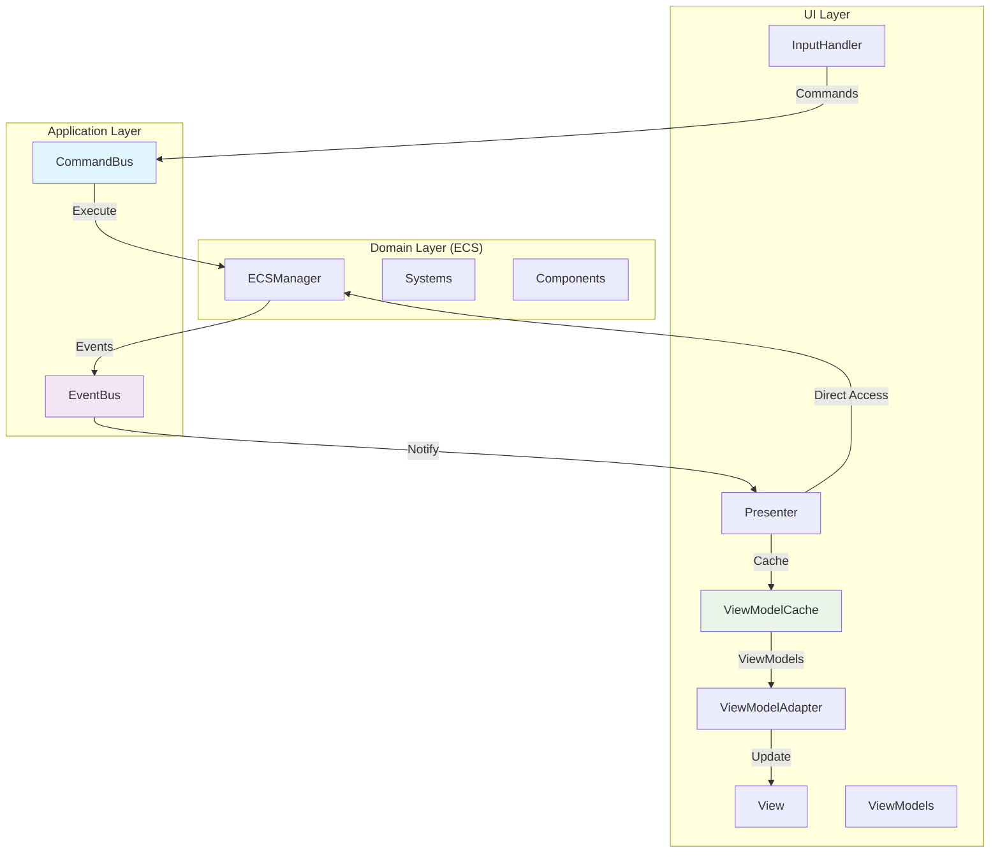

# Упрощенный план интеграции MVP с ECS архитектурой

## Проблемы текущей реализации

1. **Нарушение инкапсуляции**: [`GameWorldPresenter`](NightfallBastion/UI/Presenters/GameWorldPresenter.cs:132) напрямую обращается к [`ECSManager.Update()`](NightfallBastion/World/ECS/ECSManager.cs:131)
2. **Производительность**: [`ViewModelAdapter`](NightfallBastion/UI/Adapters/ViewModelAdapter.cs:123) пересоздает ViewModels каждый кадр
3. **Отсутствие событийной системы**: нет уведомлений об изменениях в ECS
4. **Тесная связанность**: UI слой знает о внутренностях ECS архитектуры

## Предлагаемое решение: Command/Event MVP



## 1. Система команд (Command Pattern)

### 1.1 Базовая инфраструктура

```csharp
// NightfallBastion/World/ECS/Commands/ICommand.cs
public interface ICommand
{
    void Execute(ECSManager ecsManager);
}

// NightfallBastion/World/ECS/Commands/CommandBus.cs
public class CommandBus
{
    private readonly Queue<ICommand> _commandQueue = new();
    private readonly ECSManager _ecsManager;
    
    public CommandBus(ECSManager ecsManager)
    {
        _ecsManager = ecsManager;
    }
    
    public void EnqueueCommand(ICommand command)
    {
        _commandQueue.Enqueue(command);
    }
    
    public void ProcessCommands()
    {
        while (_commandQueue.Count > 0)
        {
            var command = _commandQueue.Dequeue();
            command.Execute(_ecsManager);
        }
    }
}
```

### 1.2 Игровые команды

```csharp
// NightfallBastion/World/ECS/Commands/GameplayCommands.cs
public class MoveEntityCommand : ICommand
{
    private readonly Entity _entity;
    private readonly Vector2 _targetPosition;
    
    public MoveEntityCommand(Entity entity, Vector2 targetPosition)
    {
        _entity = entity;
        _targetPosition = targetPosition;
    }
    
    public void Execute(ECSManager ecsManager)
    {
        var movementTarget = ecsManager.GetComponent<MovementTargetComp>(_entity);
        if (movementTarget.HasValue)
        {
            var updated = movementTarget.Value;
            updated.target = _targetPosition;
            ecsManager.AddComponent(_entity, updated);
        }
    }
}

public class BuildStructureCommand : ICommand
{
    private readonly Vector2 _position;
    private readonly BuildingType _buildingType;
    
    public BuildStructureCommand(Vector2 position, BuildingType buildingType)
    {
        _position = position;
        _buildingType = buildingType;
    }
    
    public void Execute(ECSManager ecsManager)
    {
        EntitiesFactory.CreateBuilding(ecsManager, _position, _buildingType);
    }
}

public class SelectEntityCommand : ICommand
{
    private readonly Vector2 _worldPosition;
    
    public SelectEntityCommand(Vector2 worldPosition)
    {
        _worldPosition = worldPosition;
    }
    
    public void Execute(ECSManager ecsManager)
    {
        // Логика выбора сущности по позиции
        var entities = ecsManager.GetEntitiesWithComponents<PositionComp>();
        foreach (var entity in entities)
        {
            var position = ecsManager.GetComponent<PositionComp>(entity);
            if (position.HasValue && Vector2.Distance(position.Value.position, _worldPosition) < 32f)
            {
                // Добавить компонент выбора или отправить событие
                break;
            }
        }
    }
}
```

### 1.3 Команды камеры

```csharp
// NightfallBastion/World/ECS/Commands/CameraCommands.cs
public class MoveCameraCommand : ICommand
{
    private readonly Vector2 _direction;
    private readonly float _speed;
    
    public MoveCameraCommand(Vector2 direction, float speed)
    {
        _direction = direction;
        _speed = speed;
    }
    
    public void Execute(ECSManager ecsManager)
    {
        // Камера не является ECS сущностью, поэтому обновляем напрямую
        // Или создаем специальную систему для камеры
    }
}

public class ZoomCameraCommand : ICommand
{
    private readonly float _zoomDelta;
    
    public ZoomCameraCommand(float zoomDelta)
    {
        _zoomDelta = zoomDelta;
    }
    
    public void Execute(ECSManager ecsManager)
    {
        // Аналогично команде движения камеры
    }
}
```

## 2. Система событий (Observer Pattern)

### 2.1 Базовая инфраструктура

```csharp
// NightfallBastion/World/ECS/Events/IEvent.cs
public interface IEvent
{
    DateTime Timestamp { get; }
}

// NightfallBastion/World/ECS/Events/EventBus.cs
public class EventBus
{
    private readonly Dictionary<Type, List<Action<IEvent>>> _subscribers = new();
    
    public void Subscribe<T>(Action<T> handler) where T : IEvent
    {
        var eventType = typeof(T);
        if (!_subscribers.ContainsKey(eventType))
            _subscribers[eventType] = new List<Action<IEvent>>();
            
        _subscribers[eventType].Add(evt => handler((T)evt));
    }
    
    public void Publish<T>(T eventData) where T : IEvent
    {
        var eventType = typeof(T);
        if (_subscribers.TryGetValue(eventType, out var handlers))
        {
            foreach (var handler in handlers)
                handler(eventData);
        }
    }
}
```

### 2.2 Игровые события

```csharp
// NightfallBastion/World/ECS/Events/GameEvents.cs
public class EntityCreatedEvent : IEvent
{
    public DateTime Timestamp { get; } = DateTime.Now;
    public Entity Entity { get; }
    public Vector2 Position { get; }
    public string EntityType { get; }
    
    public EntityCreatedEvent(Entity entity, Vector2 position, string entityType)
    {
        Entity = entity;
        Position = position;
        EntityType = entityType;
    }
}

public class EntityDestroyedEvent : IEvent
{
    public DateTime Timestamp { get; } = DateTime.Now;
    public Entity Entity { get; }
    
    public EntityDestroyedEvent(Entity entity)
    {
        Entity = entity;
    }
}

public class ComponentChangedEvent : IEvent
{
    public DateTime Timestamp { get; } = DateTime.Now;
    public Entity Entity { get; }
    public Type ComponentType { get; }
    
    public ComponentChangedEvent(Entity entity, Type componentType)
    {
        Entity = entity;
        ComponentType = componentType;
    }
}

public class HealthChangedEvent : IEvent
{
    public DateTime Timestamp { get; } = DateTime.Now;
    public Entity Entity { get; }
    public float NewHealth { get; }
    public float MaxHealth { get; }
    
    public HealthChangedEvent(Entity entity, float newHealth, float maxHealth)
    {
        Entity = entity;
        NewHealth = newHealth;
        MaxHealth = maxHealth;
    }
}

public class CameraChangedEvent : IEvent
{
    public DateTime Timestamp { get; } = DateTime.Now;
    public Vector2 Position { get; }
    public float Zoom { get; }
    
    public CameraChangedEvent(Vector2 position, float zoom)
    {
        Position = position;
        Zoom = zoom;
    }
}
```

## 3. Кэширование ViewModels

### 3.1 ViewModelCache

```csharp
// NightfallBastion/UI/Cache/ViewModelCache.cs
public class ViewModelCache
{
    private readonly Dictionary<int, EnemyViewModel> _entityViewModels = new();
    private readonly HashSet<int> _invalidatedEntities = new();
    private TileMapViewModel _cachedTileMapViewModel;
    private CameraViewModel _cachedCameraViewModel;
    private bool _tileMapInvalidated = true;
    private bool _cameraInvalidated = true;
    
    public List<EnemyViewModel> GetEntityViewModels(ECSManager ecsManager)
    {
        var result = new List<EnemyViewModel>();
        var entities = ecsManager.GetEntitiesWithComponents<EnemyComp, PositionComp>();
        
        foreach (var entity in entities)
        {
            if (_invalidatedEntities.Contains(entity.Id) || 
                !_entityViewModels.TryGetValue(entity.Id, out var viewModel))
            {
                viewModel = CreateEntityViewModel(entity, ecsManager);
                _entityViewModels[entity.Id] = viewModel;
                _invalidatedEntities.Remove(entity.Id);
            }
            else
            {
                UpdateEntityViewModel(viewModel, entity, ecsManager);
            }
            
            result.Add(viewModel);
        }
        
        // Удаляем ViewModels для несуществующих сущностей
        var existingEntityIds = entities.Select(e => e.Id).ToHashSet();
        var toRemove = _entityViewModels.Keys.Where(id => !existingEntityIds.Contains(id)).ToList();
        foreach (var id in toRemove)
        {
            _entityViewModels.Remove(id);
        }
        
        return result;
    }
    
    public TileMapViewModel GetTileMapViewModel(TileMap tileMap)
    {
        if (_tileMapInvalidated || _cachedTileMapViewModel == null)
        {
            _cachedTileMapViewModel = CreateTileMapViewModel(tileMap);
            _tileMapInvalidated = false;
        }
        
        return _cachedTileMapViewModel;
    }
    
    public CameraViewModel GetCameraViewModel(Camera camera)
    {
        if (_cameraInvalidated || _cachedCameraViewModel == null)
        {
            _cachedCameraViewModel = CreateCameraViewModel(camera);
            _cameraInvalidated = false;
        }
        else
        {
            UpdateCameraViewModel(_cachedCameraViewModel, camera);
        }
        
        return _cachedCameraViewModel;
    }
    
    public void InvalidateEntity(int entityId)
    {
        _invalidatedEntities.Add(entityId);
    }
    
    public void InvalidateTileMap()
    {
        _tileMapInvalidated = true;
    }
    
    public void InvalidateCamera()
    {
        _cameraInvalidated = true;
    }
    
    private EnemyViewModel CreateEntityViewModel(Entity entity, ECSManager ecsManager)
    {
        var position = ecsManager.GetComponent<PositionComp>(entity);
        var health = ecsManager.GetComponent<HealthComp>(entity);
        
        return new EnemyViewModel(
            position?.position.X ?? 0,
            position?.position.Y ?? 0,
            health?.currentHealth ?? 1,
            health?.maxHealth ?? 1,
            new Rectangle(0, 0, 32, 32), // Default texture region
            1.0f
        );
    }
    
    private void UpdateEntityViewModel(EnemyViewModel viewModel, Entity entity, ECSManager ecsManager)
    {
        var position = ecsManager.GetComponent<PositionComp>(entity);
        var health = ecsManager.GetComponent<HealthComp>(entity);
        
        if (position.HasValue)
        {
            viewModel.X = position.Value.position.X;
            viewModel.Y = position.Value.position.Y;
        }
        
        if (health.HasValue)
        {
            viewModel.Health = health.Value.currentHealth;
            viewModel.MaxHealth = health.Value.maxHealth;
        }
    }
}
```

## 4. Обновленный Presenter

### 4.1 Упрощенный GameWorldPresenter

```csharp
// NightfallBastion/UI/Presenters/GameWorldPresenter.cs (обновленный)
public class GameWorldPresenter : Presenter, IDisposable
{
    private readonly GameWorldView _view;
    private readonly CommandBus _commandBus;
    private readonly EventBus _eventBus;
    private readonly ViewModelCache _viewModelCache;
    private readonly GameWorld _gameWorld;
    
    public GameWorldPresenter(
        NightfallBastionGame game, 
        GameWorldView view,
        GameWorld gameWorld)
        : base(game)
    {
        _view = view;
        _gameWorld = gameWorld;
        _commandBus = gameWorld.CommandBus;
        _eventBus = gameWorld.EventBus;
        _viewModelCache = new ViewModelCache();
        
        SubscribeToEvents();
        InitializeView();
    }
    
    private void SubscribeToEvents()
    {
        _eventBus.Subscribe<EntityCreatedEvent>(OnEntityCreated);
        _eventBus.Subscribe<EntityDestroyedEvent>(OnEntityDestroyed);
        _eventBus.Subscribe<ComponentChangedEvent>(OnComponentChanged);
        _eventBus.Subscribe<HealthChangedEvent>(OnHealthChanged);
        _eventBus.Subscribe<CameraChangedEvent>(OnCameraChanged);
    }
    
    public void Update(GameTime gameTime)
    {
        var keyboardState = Keyboard.GetState();
        var mouseState = Mouse.GetState();
        
        HandleInput(keyboardState, mouseState, gameTime);
        UpdateView();
        
        _game.SceneManager.InputHandler.UpdatePreviousStates(keyboardState, mouseState);
    }
    
    private void HandleInput(KeyboardState keyboardState, MouseState mouseState, GameTime gameTime)
    {
        var cameraInput = _game.SceneManager.InputHandler.HandleCameraInput(
            keyboardState, mouseState, gameTime, _game.GameplaySettings.CameraSpeed);
            
        if (cameraInput.MovementDirection != Vector2.Zero)
        {
            _commandBus.EnqueueCommand(new MoveCameraCommand(
                cameraInput.MovementDirection, cameraInput.MovementSpeed));
        }
        
        if (Math.Abs(cameraInput.ZoomDelta) > 0.001f)
        {
            _commandBus.EnqueueCommand(new ZoomCameraCommand(cameraInput.ZoomDelta));
        }
        
        var gameplayInput = _game.SceneManager.InputHandler.HandleGameplayInput(
            keyboardState, mouseState, gameTime);
            
        if (gameplayInput.LeftMouseClicked && gameplayInput.MouseClickPosition.HasValue)
        {
            var worldPosition = _gameWorld.ScreenToWorld(gameplayInput.MouseClickPosition.Value);
            _commandBus.EnqueueCommand(new SelectEntityCommand(worldPosition));
        }
        
        if (gameplayInput.RightMouseClicked && gameplayInput.MouseClickPosition.HasValue)
        {
            var worldPosition = _gameWorld.ScreenToWorld(gameplayInput.MouseClickPosition.Value);
            _commandBus.EnqueueCommand(new BuildStructureCommand(worldPosition, BuildingType.Wall));
        }
    }
    
    private void UpdateView()
    {
        // Обновляем ViewModels через кэш
        var enemyViewModels = _viewModelCache.GetEntityViewModels(_gameWorld.ECSManager);
        _view.UpdateEnemies(enemyViewModels);
        
        var cameraViewModel = _viewModelCache.GetCameraViewModel(_gameWorld.Camera);
        _view.CurrentCameraViewModel = cameraViewModel;
        
        if (_gameWorld.TileMap != null)
        {
            var tileMapViewModel = _viewModelCache.GetTileMapViewModel(_gameWorld.TileMap);
            _view.CurrentTileMapViewModel = tileMapViewModel;
        }
        
        _view.Draw();
    }
    
    // Event handlers
    private void OnEntityCreated(EntityCreatedEvent evt)
    {
        _viewModelCache.InvalidateEntity(evt.Entity.Id);
    }
    
    private void OnEntityDestroyed(EntityDestroyedEvent evt)
    {
        _viewModelCache.InvalidateEntity(evt.Entity.Id);
    }
    
    private void OnComponentChanged(ComponentChangedEvent evt)
    {
        _viewModelCache.InvalidateEntity(evt.Entity.Id);
    }
    
    private void OnHealthChanged(HealthChangedEvent evt)
    {
        _viewModelCache.InvalidateEntity(evt.Entity.Id);
    }
    
    private void OnCameraChanged(CameraChangedEvent evt)
    {
        _viewModelCache.InvalidateCamera();
    }
    
    public void Dispose()
    {
        // Отписка от событий не требуется, так как EventBus будет уничтожен вместе с GameWorld
    }
}
```

## 5. Интеграция с ECS

### 5.1 Обновленный GameWorld

```csharp
// NightfallBastion/World/GameWorld.cs (обновленный)
public class GameWorld : IDisposable
{
    public ECSManager ECSManager { get; private set; } = new();
    public Camera Camera { get; private set; }
    public CommandBus CommandBus { get; private set; }
    public EventBus EventBus { get; private set; }
    public TileMap TileMap { get; private set; }
    
    private readonly NightfallBastionGame _game;
    
    public GameWorld(NightfallBastionGame game)
    {
        _game = game;
        EventBus = new EventBus();
        CommandBus = new CommandBus(ECSManager);
        
        CreateCamera();
        LoadContent();
    }
    
    public void LoadContent()
    {
        TileMap = EntitiesFactory.CreateTileMap(
            this,
            _game.CoreSettings.DefaultMapWidth,
            _game.CoreSettings.DefaultMapHeight
        );
        
        AddSystems();
    }
    
    private void AddSystems()
    {
        ECSManager.AddSystem(new EventAwareMovementSystem(this, EventBus));
        ECSManager.AddSystem(new EventAwareHealthSystem(this, EventBus));
        ECSManager.AddSystem(new PathfindSystem(this));
        ECSManager.AddSystem(new PhysicsSystem(this));
        ECSManager.AddSystem(new WeaponSystem(this));
        ECSManager.AddSystem(new CommandProcessingSystem(this, CommandBus));
    }
    
    public void Update(GameTime gameTime)
    {
        // Сначала обрабатываем команды
        CommandBus.ProcessCommands();
        
        // Затем обновляем ECS системы
        ECSManager.Update(gameTime);
    }
    
    // Методы для работы с камерой остаются без изменений
    public Vector2 ScreenToWorld(Vector2 screenPosition) => Camera.ScreenToWorld(screenPosition);
    public Vector2 WorldToScreen(Vector2 worldPosition) => Camera.WorldToScreen(worldPosition);
    public Matrix GetCameraTransformMatrix() => Camera.GetTransformMatrix();
    public bool IsInCameraView(Vector2 worldPosition) => Camera.IsInView(worldPosition);
    
    public void Dispose()
    {
        ECSManager?.Dispose();
        CommandBus = null;
        EventBus = null;
    }
}
```

### 5.2 Event-Aware системы

```csharp
// NightfallBastion/World/ECS/Systems/EventAwareMovementSystem.cs
public class EventAwareMovementSystem : System
{
    private readonly EventBus _eventBus;
    
    public EventAwareMovementSystem(GameWorld world, EventBus eventBus) : base(world)
    {
        _eventBus = eventBus;
    }
    
    public override void Update(GameTime gameTime)
    {
        var entities = _world.ECSManager.GetEntitiesWithComponents<PositionComp, MovementComp>();
        
        foreach (var entity in entities)
        {
            var position = _world.ECSManager.GetComponent<PositionComp>(entity);
            var movement = _world.ECSManager.GetComponent<MovementComp>(entity);
            
            if (position.HasValue && movement.HasValue && movement.Value.isMoving)
            {
                var oldPosition = position.Value.position;
                var newPosition = CalculateNewPosition(position.Value, movement.Value, gameTime);
                
                if (Vector2.Distance(oldPosition, newPosition) > 0.1f)
                {
                    var updatedPosition = position.Value;
                    updatedPosition.position = newPosition;
                    _world.ECSManager.AddComponent(entity, updatedPosition);
                    
                    // Публикуем событие об изменении позиции
                    _eventBus.Publish(new ComponentChangedEvent(entity, typeof(PositionComp)));
                }
            }
        }
    }
    
    private Vector2 CalculateNewPosition(PositionComp position, MovementComp movement, GameTime gameTime)
    {
        var direction = Vector2.Normalize(movement.nextPosition - position.position);
        var distance = movement.speed * (float)gameTime.ElapsedGameTime.TotalSeconds;
        return position.position + direction * distance;
    }
}

// NightfallBastion/World/ECS/Systems/EventAwareHealthSystem.cs
public class EventAwareHealthSystem : System
{
    private readonly EventBus _eventBus;
    
    public EventAwareHealthSystem(GameWorld world, EventBus eventBus) : base(world)
    {
        _eventBus = eventBus;
    }
    
    public override void Update(GameTime gameTime)
    {
        var entities = _world.ECSManager.GetEntitiesWithComponents<HealthComp>();
        
        foreach (var entity in entities)
        {
            var health = _world.ECSManager.GetComponent<HealthComp>(entity);
            if (health.HasValue)
            {
                var oldHealth = health.Value.currentHealth;
                var newHealth = ProcessHealthChanges(health.Value, gameTime);
                
                if (Math.Abs(oldHealth - newHealth.currentHealth) > 0.001f)
                {
                    _world.ECSManager.AddComponent(entity, newHealth);
                    
                    _eventBus.Publish(new HealthChangedEvent(
                        entity, newHealth.currentHealth, newHealth.maxHealth));
                    
                    if (newHealth.currentHealth <= 0)
                    {
                        _eventBus.Publish(new EntityDestroyedEvent(entity));
                        _world.ECSManager.DestroyEntity(entity);
                    }
                }
            }
        }
    }
    
    private HealthComp ProcessHealthChanges(HealthComp health, GameTime gameTime)
    {
        // Логика обработки изменений здоровья (регенерация, урон и т.д.)
        return health;
    }
}

// NightfallBastion/World/ECS/Systems/CommandProcessingSystem.cs
public class CommandProcessingSystem : System
{
    private readonly CommandBus _commandBus;
    
    public CommandProcessingSystem(GameWorld world, CommandBus commandBus) : base(world)
    {
        _commandBus = commandBus;
    }
    
    public override void Update(GameTime gameTime)
    {
        // Команды обрабатываются в GameWorld.Update() перед системами
        // Эта система может использоваться для специальной логики обработки команд
    }
}
```

## 6. Преимущества упрощенной архитектуры

### 6.1 Простота реализации
- **Меньше абстракций**: только Command/Event паттерны
- **Прямой доступ к ECS**: Presenter может читать данные напрямую из ECS
- **Знакомые паттерны**: MVP остается основным паттерном

### 6.2 Производительность
- **Кэширование ViewModels**: обновление только при изменениях
- **Event-driven обновления**: UI обновляется только при необходимости
- **Batch processing**: команды обрабатываются пакетами

### 6.3 Разделение ответственности
- **Команды**: для изменения состояния ECS
- **События**: для уведомления UI об изменениях
- **Кэш**: для оптимизации создания ViewModels

### 6.4 Легкость миграции
- **Постепенное внедрение**: можно мигрировать по частям
- **Совместимость**: работает с существующим кодом
- **Минимальные изменения**: в основном добавление новых классов

## 7. План реализации

### Этап 1: Базовая инфраструктура
1. Создать интерфейсы и базовые классы для команд и событий
2. Реализовать CommandBus и EventBus
3. Добавить ViewModelCache

### Этап 2: Интеграция с ECS
1. Обновить GameWorld для поддержки Command/Event
2. Создать Event-Aware системы
3. Добавить базовые команды и события

### Этап 3: Обновление UI
1. Модифицировать GameWorldPresenter
2. Интегрировать кэширование ViewModels
3. Подписаться на события

### Этап 4: Тестирование и оптимизация
1. Протестировать производительность
2. Оптимизировать кэширование
3. Добавить недостающие команды и события

Этот упрощенный план сохраняет основные преимущества Event-Driven архитектуры, но убирает сложность CQRS паттерна, делая решение более простым для понимания и реализации.